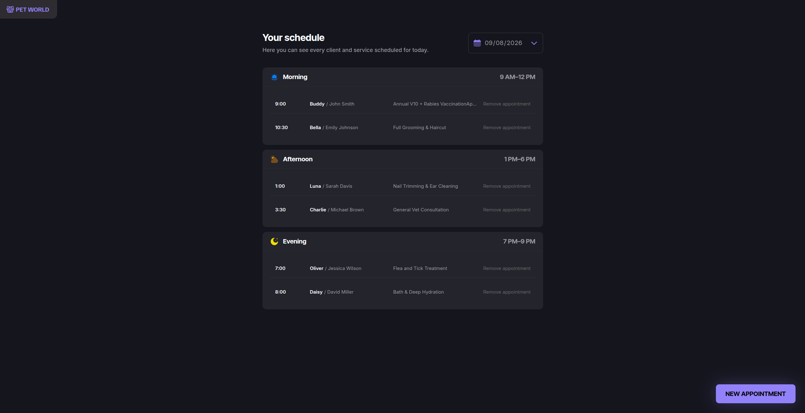
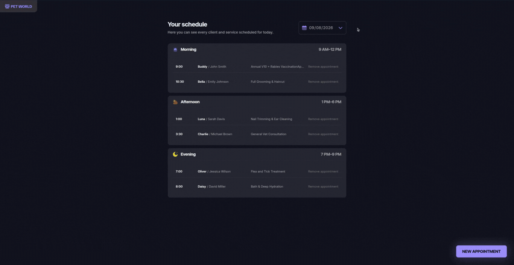
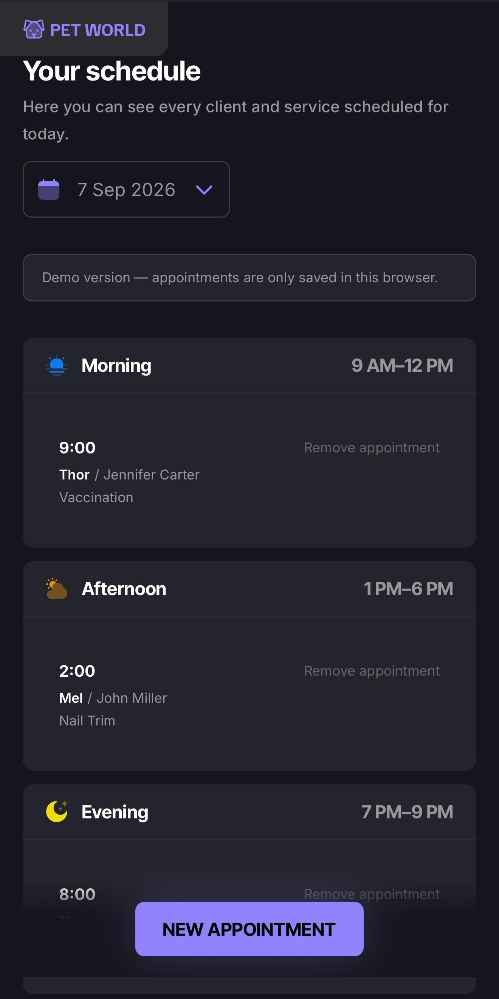

# 🐾 Pet World — Appointment Schedule

<p align="center">
  Appointment scheduling interface for a pet shop, built with JavaScript, HTML, CSS, Webpack, and json-server.
</p>

<p align="center">
  Part of the <strong>Rocketseat Full Stack learning track</strong>.
</p>

<p align="center">
  
  
  
  
  
  
</p>

<p align="center">
  <a href="https://github.com/Janesaraujo/Pet-World">
    
  </a>
  <a href="YOUR_VERCEL_URL">
    
  </a>
</p>

---

## 🐾 About the project


Pet World is a scheduling app for a pet shop's front desk: it keeps a day's appointments organized by time period, lets staff book a new one through a validated form, and prevents the kind of mistakes a paper agenda wouldn't catch — like double-booking the same slot.

It's built as a Figma-to-code project from the **Rocketseat Full Stack learning track**, using **vanilla JavaScript** (no front-end framework), bundled with **Webpack**, with **json-server** standing in as a REST API during development.

## 🐾 What the application does

**Purpose.** The app answers one question for whoever's running the front desk: _what does today (or any other day) look like?_ It shows every appointment for a chosen date, grouped by period, and provides a guided form for adding a new one without double-booking or leaving required information out.

**Main flow.** The screen that loads first is the day's schedule: a date field at the top (defaulting to today) and three sections — Morning, Afternoon, Evening — each listing that period's appointments. Changing the date reloads the list for that day. Clicking **New appointment** opens a modal with a form: the owner's name, the pet's name, a phone number, a service description, a date, and a time slot. Submitting it validates every field, and — once everything checks out — closes the modal, adds the new appointment to the right section (re-sorted by time), and shows a confirmation message. Removing an appointment asks for confirmation first, then reloads the list.

**How appointments are organized.** Every appointment belongs to one of three fixed daily periods — Morning (9 AM–12 PM), Afternoon (1 PM–6 PM), Evening (7 PM–9 PM) — determined purely by its time. Within a period, appointments are sorted chronologically. Time slots themselves are generated in fixed 30-minute increments across those windows, so the "pick a time" step is always a list of valid options rather than free text.

**Validation and conflicts.** Before anything is saved:

- The owner's name, pet's name, and service description are required.
- The phone number is checked against the digit count expected for whichever country is selected (see "What I changed" below).
- The date must be a real, validly-formatted date.
- The time must fall inside business hours, land on a 30-minute increment, and — for today's date — not already be in the past.
- The time slot must not already be taken by another appointment on the same date.

Each rule maps to a specific field, so a person sees exactly which field is wrong and why; the message disappears as soon as they start correcting that field.

**Responsive behavior.** The same screens work down to a 390px-wide phone frame: the appointment row that reads as one line on desktop restacks into a small card, the floating "New appointment" button becomes a bar fixed to the bottom of the screen, and the modal expands to use the full available width instead of floating in the center.

---

## 🏗️ How it is built

The project has no front-end framework and no build-time templating language — every screen update happens through direct DOM calls. To keep that manageable, the code is split into three layers with a strict, one-way dependency rule: `modules` may import `services` and `utils`, but `services` and `utils` never import `modules`. That keeps the data and helper code testable on its own, without a browser DOM in the picture.

**Module layers.**

- **`services/`** talks to the data and nothing else — it has no idea a DOM exists. `scheduleDay`, `scheduleNew`, and `scheduleCancel` are the only functions the rest of the app calls to read or write appointments.
- **`utils/`** holds pure functions with no side effects: time-slot math, date formatting, phone-number formatting and parsing, and the shared list of DOM element references.
- **`modules/`** is everything that touches the page: rendering the schedule, opening/closing the modal, wiring up form fields, and reacting to clicks.

**Data flow and the two API drivers.** A UI module never talks to `fetch` or `localStorage` directly — it calls a `services/` function, which delegates to whichever **driver** is active. There are two: one that calls a real `json-server` REST API over HTTP, and one that reads and writes the browser's `localStorage`. Which driver gets used is decided once, at build time, through a Webpack `DefinePlugin` constant — not by a runtime check — so the app never branches on "which mode am I in," and the unused driver isn't even included in the bundle. `npm run dev` builds against the HTTP driver (against `server.json`, served by json-server); `npm run build` builds against the `localStorage` driver, because a static host like Vercel can't run a server for it. Every visitor to that build gets their own local data, and the screen says so.

**Rendering without a framework.** Appointment cards are cloned from an HTML `<template>` and filled in with `textContent`; the time-slot list and the phone country dropdown are built by mapping a data array straight into `createElement` calls. Whenever the underlying data changes, the relevant list is rebuilt wholesale with `replaceChildren()` rather than patched piece by piece — simpler to reason about than manual diffing, and fast enough at this scale.

**Forms and validation.** All the rules described above live in one pure function that takes the form's data and returns a plain object mapping field name to error message (or nothing, if it's valid). The UI layer's only job is to paint whatever that function returns next to each field, and clear a message the moment the user edits that field again.

**The modal (`<dialog>`).** "New appointment" is a native `<dialog>` element rather than a hand-built overlay. That means the browser already handles blocking interaction with the page behind it and closing on Escape; the app only wires up the X button, closing when the backdrop is clicked, and resetting the form's fields each time it opens.

**Build tooling.** Webpack bundles the JS and CSS, runs the dev server, and injects the build-mode constant mentioned above. Babel (`@babel/preset-env`) transpiles modern syntax down to whatever the project's `browserslist` targets require — a safety net for older browsers more than something the current targets actually need.

---

## 🌍 What I changed

The screens, the flow, and the validation rules described above follow the original Rocketseat brief. Three things extend it — the app is still, first and foremost, a pet shop scheduler; these are additions on top of it, not a rewrite of what it is:

- **Full English translation** of the interface, since a project meant to be shown outside one country shouldn't be pinned to one language.
- **A phone field that adapts to any country**, instead of one hardcoded mask.
- **Locale-aware date and time formatting**, instead of one hardcoded convention.

The phone field is the one worth walking through, because it didn't arrive in its current shape on the first try — getting it right took three passes:

**Pass 1 — I just swapped one hardcoded country for another.** Translating the app, I replaced the Brazilian mask `(00) 0 0000-0000` with a fixed US one, `+1 (000) 000-0000`. That also hid a real bug: the mask embedded the `+1` literal into the text field, and since a progressive mask re-runs on its own output on every keystroke, it started counting that embedded digit as if the user had typed it — silently corrupting the number a few digits in. Testing full keystroke sequences (not just finished numbers) is what surfaced it; the fix was making the mask idempotent, so it recognizes and strips its own previously-added prefix before re-parsing.

**Pass 2 — a typed country code.** Fair feedback: a `+1` on a Brazilian number looks wrong to a Brazilian user. I moved to a manually-typed dial code (1–3 digits, since codes aren't a fixed length) ahead of a Brazil-style local mask. Better, but still one shape wearing different costumes.

**Pass 3 — an actual country picker.** The phone field is now a hand-built selector: 20 countries plus "Other," chosen from a dropdown, each with its own dial code and expected number length. I skipped a library like `intl-tel-input`/libphonenumber on purpose — a pet shop's contact field doesn't need a 100+ KB global phone-number database, so a small hand-written country table does the job at a fraction of the size. Picking a country switches both the mask (dedicated formats for Brazil and the US/Canada, a generic grouping for everyone else) and the validation rule (each country's expected digit count); the default selection is guessed from the visitor's browser language.

Two more corrections came from actually using it, not just building it:

- **No flag icons.** The plan was flags next to each country name. Testing on Linux showed flag emoji don't render reliably there, so I replaced them with plain text (`"Brazil (+55)"`) — identical everywhere, and better for screen readers besides.
- **A silent-corruption bug in the country switch.** Type an 11-digit Brazilian number, then switch to the US: the mask used to truncate to 10 digits — and because 10 happens to be exactly what US validation expects, the wrong, truncated number passed as valid with no error. The fix makes the mask keep every digit it's given; an over-long number now fails validation loudly instead of getting quietly cut down to something that looks right.

The date and time work followed the same logic on a smaller scale: rather than pick a second fixed country to hardcode, `Intl.DateTimeFormat` reads the visitor's own locale, so the same appointment reads naturally whether it's viewed from São Paulo, London, or Tokyo.

---

## 🎨 Design Reference

The interface follows a Figma proposal ("Pet Shop Scheduling") provided as part of the course — layout, typography, colors, appointment cards, and the scheduling form all come from that design.

---

## 🧠 What I practiced

- **JavaScript ES Modules**, structured into `services` (data access), `utils` (pure functions), and `modules` (DOM/UI) — a one-way dependency rule keeps `utils` testable without touching the DOM.
- **Framework-free DOM manipulation** — rendering, updating, and removing elements by hand, which forces a real understanding of what triggers a re-render instead of trusting a framework's diffing.
- **Form validation from scratch** — required fields, per-field messages, and conflict detection, all without a validation library.
- **`Intl.DateTimeFormat`**, to format dates and times per the visitor's own locale instead of a hardcoded convention.
- **`localStorage`**, as the zero-backend persistence option for the published build.
- **REST API basics**, practiced against a real `json-server` instance in development.
- **Webpack configuration** — loaders, dev server, and a build-time constant (`DefinePlugin`) that decides which data layer gets bundled.
- **Babel**, to transpile for the project's `browserslist` targets.
- **Responsive CSS** — one 390px breakpoint reshaping the same components, instead of a second layout to maintain.
- **The native `<dialog>` element**, for modal focus-handling and Escape/backdrop closing without hand-rolling either.
- **Debugging a genuinely subtle bug** — an input mask that corrupted its own output — by testing actual keystroke sequences instead of just finished values.

---

## 🛠️ Technologies

- **JavaScript (ES Modules)**
- **HTML5** — semantic markup, including a native `<dialog>` for the modal
- **CSS3** — Custom Properties for the Figma design tokens (color, spacing)
- **Webpack** — bundling, dev server, and the build-mode switch
- **Babel** (`@babel/preset-env`)
- **dayjs** — internal date math only (`isHourPast`, `isValidDate`, `today()`)
- **`Intl.DateTimeFormat`** (native, no library) — locale-aware date/time display
- **json-server** — fake REST API used in development
- **Figma** — source of the visual design
- **Vercel** — deployment target for the static, `localStorage`-backed build

---

## 🚀 Getting Started

Requires **Node.js 20+**.

### Clone the repository

```bash
git clone https://github.com/Janesaraujo/Pet-World.git
cd Pet-World
```

### Install and run

```bash
npm install   # only the first time
npm run dev   # brings up the API and the site together
```

The app runs at **http://localhost:5500**, and the API at **http://localhost:3333/schedules**.

To see the original sample data, change the date at the top to **01/10/2024**.

| Command         | What it does                                                        |
| --------------- | ------------------------------------------------------------------- |
| `npm run dev`   | API + site together (day-to-day use)                                |
| `npm run web`   | Just the webpack dev server, with hot reload                        |
| `npm run api`   | Just json-server                                                    |
| `npm run build` | Production build into `dist/` (the `localStorage`-backed demo mode) |

---

## 👀 Preview


### Desktop




### Mobile




## 👤 Author

Developed by **Janes Araujo**

<a href="https://github.com/Janesaraujo">GitHub</a>

## 📄 License

This project is licensed under the **MIT License**. See [LICENSE](LICENSE) for details.
# Pet-World
